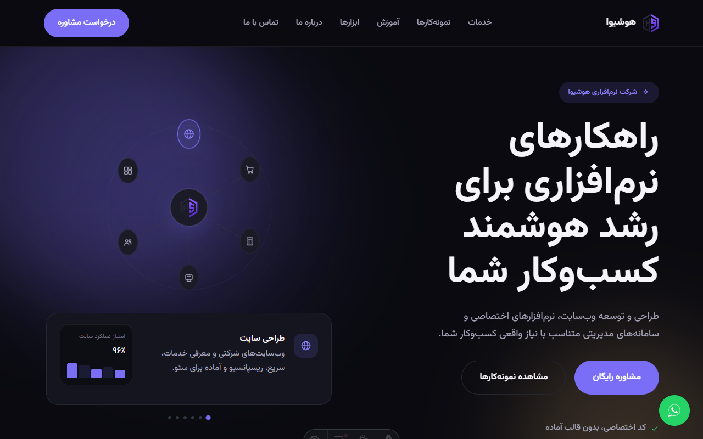

<div align="center">


# هوشیوا | Houshiva

راهکارهای نرم‌افزاری برای رشد هوشمند کسب‌وکار — سایت رسمی و ابزارهای آنلاین هوشیوا

[](https://astro.build)
[](https://www.typescriptlang.org/)
[](https://nodejs.org)


</div>

<br />



## درباره پروژه

این ریپازیتوری سورس‌کد **وب‌سایت رسمی هوشیوا** است: یک سایت معرفی خدمات به‌همراه چند ابزار آنلاین رایگان، ساخته‌شده با [Astro](https://astro.build). سایت کاملاً **استاتیک و بدون بک‌اند اختصاصی** است — فرم تماس و داده‌های زنده از طریق سرویس‌های شخص ثالث تأمین می‌شوند (به بخش [متغیرهای محیطی](#متغیرهای-محیطی) نگاه کنید).

## امکانات

- **صفحات معرفی خدمات، نمونه‌کارها و درباره ما** — طراحی سایت، فروشگاه اینترنتی، نرم‌افزار اختصاصی، حسابداری، POS، CRM، انبار، اتوماسیون، داشبورد مدیریتی
- **بخش آموزش** با مقاله (از طریق Content Collections) و ویدیو، همراه با فیلتر دسته‌بندی بدون جاوااسکریپت (CSS-only)
- **ابزارهای رایگان**: تبدیل تاریخ شمسی/میلادی، تبدیل عدد به حروف فارسی، محاسبه‌گر اقساط وام، و قیمت لحظه‌ای طلا/سکه/ارز (از [BrsApi.ir](https://brsapi.ir) در زمان build)
- **فرم تماس** بدون بک‌اند، با ارسال ایمیل از طریق [Web3Forms](https://web3forms.com)
- **دکمه شناور واتساپ** برای تماس سریع
- **سیستم رنگ‌بندی (tone system)**: هر بخش اصلی سایت (نمونه‌کارها، آموزش، ...) هویت رنگی خودش را دارد — به‌جای رنگ ثابت در کل سایت — با استفاده از CSS custom properties قابل‌بازنویسی (`src/lib/tones.ts`, `src/styles/tones.css`)
- ریسپانسیو کامل، پشتیبانی از RTL/فارسی، بهینه برای سئو (sitemap، structured data، Open Graph)

## پشته فناوری

| بخش | فناوری |
|---|---|
| فریم‌ورک | [Astro](https://astro.build) 7 |
| زبان | TypeScript (strict) |
| فونت | [Vazirmatn](https://github.com/rastikerdar/vazirmatn) |
| محتوا | Astro Content Collections (Markdown) |
| قیمت زنده | [BrsApi.ir](https://brsapi.ir) |
| فرم تماس | [Web3Forms](https://web3forms.com) |
| Sitemap | `@astrojs/sitemap` |

## شروع سریع

```bash
git clone git@github.com:Houshiva/houshiva-website.git
cd houshiva-website
npm install
```

### متغیرهای محیطی

یک فایل `.env` در ریشه پروژه بسازید (این فایل `gitignore` شده و باید دستی ساخته شود):

```bash
PUBLIC_WEB3FORMS_ACCESS_KEY=   # access key رایگان از web3forms.com — برای ارسال فرم تماس
BRSAPI_KEY=                    # access key رایگان از brsapi.ir — برای قیمت طلا/ارز در زمان build
```

### اجرای محلی

```bash
npm run dev
```

> **نکته (ویندوز):** اگر سرور "ready" نشان می‌دهد ولی صفحه در دسترس نیست، به‌جای `npm run dev` از `npx astro dev --host 127.0.0.1` استفاده کنید — روی برخی سیستم‌های ویندوز، IPv6 loopback (`::1`) که Astro به‌طور پیش‌فرض به آن bind می‌شود کار نمی‌کند.

### دستورهای دیگر

```bash
npm run build      # build نهایی برای production در ./dist
npm run preview    # پیش‌نمایش build نهایی
npm run astro check  # بررسی نوع‌ها و خطاهای Astro/TypeScript
```

## ساختار پروژه

```text
src/
├── components/      # کامپوننت‌های Astro (common, home, services, portfolio, education, tools, ...)
├── content/         # مقاله‌های آموزشی (Markdown، از طریق Content Collections)
├── data/            # داده‌های ثابت سایت (خدمات، نمونه‌کارها، ابزارها، اطلاعات تماس، ...)
├── layouts/         # MainLayout مشترک بین صفحات
├── lib/             # توابع کمکی (سیستم tone، تبدیل عدد به حروف)
├── pages/           # روت‌های سایت (فایل‌محور)
└── styles/          # توکن‌های طراحی، تایپوگرافی، utility classes
```

## کارهای باقی‌مانده

فهرست به‌روز کارهای در انتظار (اتصال دامنه به Web3Forms، rebuild خودکار برای قیمت‌های زنده و ...) در [TODO.md](TODO.md) نگهداری می‌شود.

## تماس

| | |
|---|---|
| وب‌سایت | [houshiva.ir](https://houshiva.ir) |
| ایمیل | [info@houshiva.ir](mailto:info@houshiva.ir) |
| عرفان محمدی | ۰۹۳۷۷۷۴۷۲۱۷ |
| علیرضا عالم‌شاه | ۰۹۳۵۵۹۵۸۰۴۷ |

---

<div align="center">

**این ریپازیتوری خصوصی و متعلق به تیم هوشیواست.**

</div>
